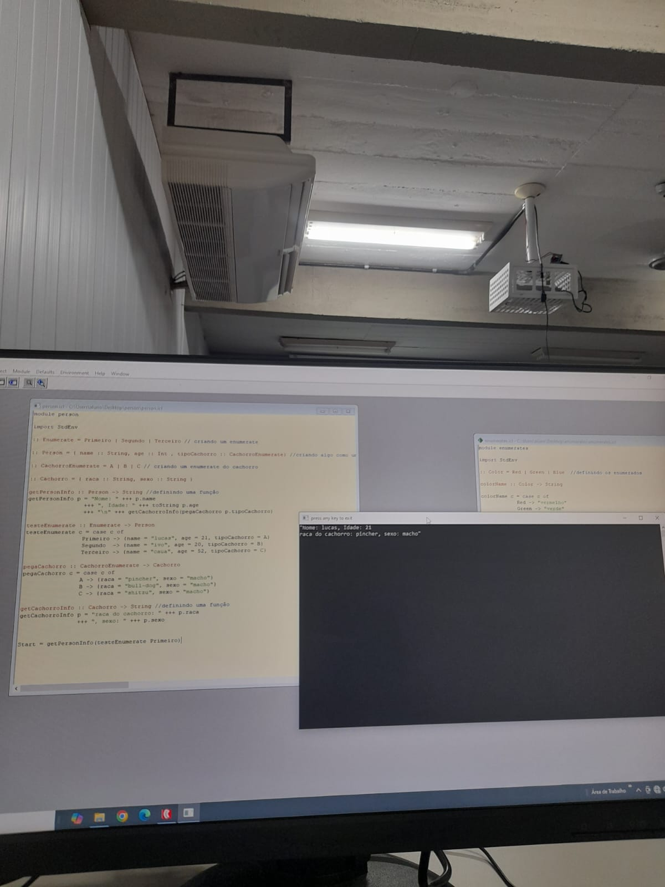

# Aprendendo programação funcional: Clean 

Bem-vindo(a) ao repositório dedicado a pequenos códigos de estudo de programação funcional e da linguagem de programação Clean.

## O que é Clean e sua Relação com a Programação Funcional?

**Clean** é uma linguagem de programação funcional **pura** e de propósito geral, desenvolvida na Universidade de Nijmegen, na Holanda. Mas o que isso significa na prática?

### Linguagem de Programação Funcional Pura

No cerne da programação funcional pura, como a praticada em Clean, está o conceito de **funções puras**. Uma função pura possui duas características principais:

1.  **Determinismo:** Para os mesmos argumentos de entrada, a função sempre produzirá o mesmo resultado.
2.  **Sem Efeitos Colaterais:** A execução da função não modifica nenhum estado fora do seu escopo (como variáveis globais, arquivos ou banco de dados). Ela apenas calcula e retorna um valor.

Em Clean, este paradigma é rigorosamente aplicado, o que traz vários benefícios:

* **Código mais seguro:** A ausência de efeitos colaterais torna o código mais fácil de testar, depurar e raciocinar, pois você sabe que uma função sempre fará exatamente o que ela se propõe a fazer, sem surpresas.
* **Concorrência facilitada:** Como as funções não alteram estados externos, é muito mais fácil executar partes do programa em paralelo sem se preocupar muito.
* **Otimização:** O compilador pode fazer otimizações mais agressivas, pois sabe que as funções não terão efeitos inesperados.

### Principais Características Funcionais do Clean:

* **Funções de Primeira Classe:** Funções podem ser tratadas como qualquer outro valor (passadas como argumento, retornadas por outras funções, armazenadas em variáveis).
* **Imutabilidade:** Os dados são imutáveis por padrão. Uma vez criado, um valor não pode ser alterado. Se você precisa de uma "modificação", na verdade, cria uma nova versão do dado. Isso elimina uma grande fonte de erros em programação.
* **Padrões de Casamento (Pattern Matching):** Uma maneira poderosa e expressiva de inspecionar dados e executar diferentes blocos de código com base na estrutura desses dados. Isso é amplamente utilizado em Clean para desestruturar listas, tuplas e tipos de dados algébricos.
* **Recursão:** Dada a ausência de laços (loops) imperativos tradicionais (como `for` ou `while`), a recursão é a maneira idiomática de iterar sobre estruturas de dados em Clean.
* **Sistema de Tipos Forte e Inferência de Tipos:** Clean possui um sistema de tipos estático muito robusto que ajuda a detectar erros em tempo de compilação. Além disso, ele tem um poderoso sistema de inferência de tipos, o que significa que você frequentemente não precisa declarar explicitamente os tipos, pois o compilador pode deduzi-los.
* **Unicidade (Uniqueness Typing):** Esta é uma característica particularmente inovadora do Clean. Ela permite que efeitos colaterais (como I/O ou manipulação de estado) sejam tratados de forma segura dentro de um paradigma puramente funcional. O sistema de tipos de unicidade garante que um recurso que causa um efeito colateral (por exemplo, um identificador de arquivo) seja acessado por apenas uma parte do programa de cada vez, permitindo que ele seja modificado sem violar a pureza funcional.

Em resumo, ao aprender Clean, você não está apenas aprendendo uma linguagem, mas também absorvendo os princípios fundamentais da **programação funcional**.

  
  
02/06/2025
  

